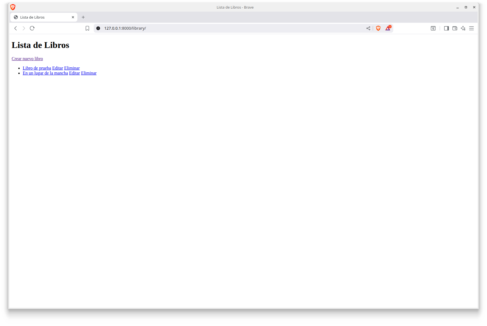
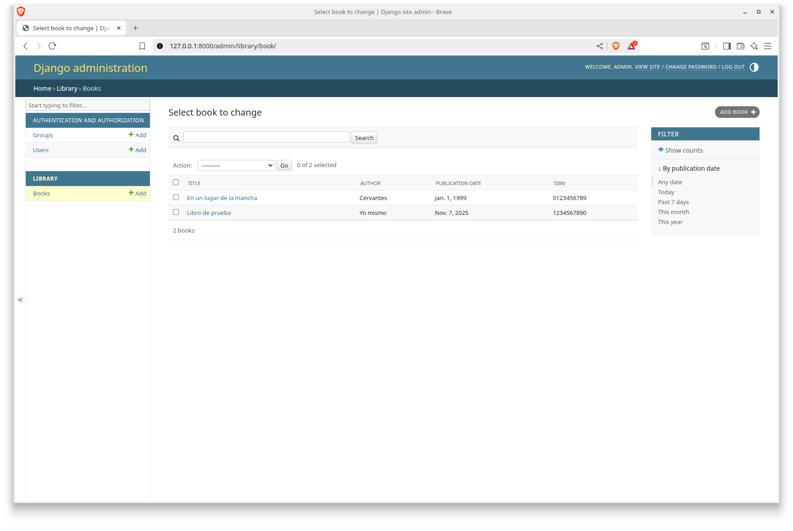

# Aplicación CRUD y django

Para información sobre como instalar la aplicación, por favor, ve a la sección [instalación](#instalación-de-la-aplicación)

### ¿Qué es un CRUD y cuál es su propósito en el desarrollo de aplicaciones web? Añade un ejemplo de aplicación web que use una estructura de CRUD

CRUD (Create, Read, Update, Delete) es un concepto fundamental en el desarrollo de software para la gestión de datos
dentro de las aplicaciones. Se refiere a las cuatro operaciones básicas que se realizan sobre los datos: crear, leer,
actualizar y eliminar. Estas operaciones permiten a los desarrolladores interactuar con datos persistentes almacenados
en bases de datos u otros sistemas de almacenamiento de datos.

Las aplicaciones web suelen implementar estas operaciones para gestionar datos de usuarios, productos, o cualquier otro
tipo de información relevante. Por ejemplo, una tienda en línea utiliza operaciones CRUD para manejar catálogos de
productos, inventario y datos de clientes.  REST, que se usa en el diseño de aplicaciones WEB, emplea operaciones HTTP
que corresponden directamente con las funciones CRUD (GET, PUT, PUSH, and DELETE).

### ¿Qué son los patrones de arquitectura en desarrollo de software?

- _¿Qué es el patrón MVC (Modelo–Vista–Controlador)?_

El patrón MVC separa la lógica de una aplicación en tres componentes distintos: el modelo, la vista y el controlador.
El modelo se encarga de gestionar los datos y la lógica de negocio, la vista es responsable de la representación de la
información al usuario, y el controlador actúa como intermediario entre el modelo y la vista, manejando las entradas
del usuario y actualizando el modelo o la vista según sea necesario

- _¿Qué es el patrón MVT (Modelo–Vista–Template)?_

Este patrón es una variante del patrón MVC (Modelo-Vista-Controlador) utilizado ampliamente en el diseño de software.
El patrón MVT divide la estructura de una aplicación en tres partes interconectadas, lo que permite un desarrollo más
ordenado y menos complicado. Las tres partes son: el Modelo, la Vista y la Plantilla. El Modelo se refiere a la
estructura de datos, la vista es el lugar donde se establece la lógica de negocio y la plantilla es donde se muestra el
resultado.

- _Diferencias entre MVC y MVT._

La principal diferencia es que en el patrón MVC, debemos escribir toda la lógica de control, mientras que en el patrón
MVT, la lógica de control ya esta implementada.

- ¿Cuál de estos dos patrones se usa en Django?

Django usa el patrón MVT.

### ¿Cómo se estructura un proyecto en Django? Explicar brevemente el rol de los modelos, vistas, templates y URLs.

El rol _modelo_ se utiliza para la creación y mantenimiento de las tablas de base de datos.
El rol _vista_ define las vistas que podemos tener (lo que ve u obtiene un usuario) donde los datos se obtiene a
partir de los modelos obtenidos.
El rol _plantilla_ nos permite modificar la salida que obtenemos de las vistas. Por ejemplo, podemos crear código HTML
usando las plantillas adecuadas.
El rol _url_ se encarga de definir las urls disponibles en la aplicación de django, relacionando ademas las urls con las vistas.

Para crear un proyecto en django, primero debemos ejecutar lo siguiente:

```commandline
django-admin startproject <mysite> .
```

Esto creará lo siguiente:

- El fichero _manage.py_, que nos ayuda con la administración del proyecto.
- Una carpeta de nombre _\<mysite\>_ que contiene la configuración básica del proyecto. Entre otros, estan los
  siguientes archivos:
  - El archivo _settings.py_ contiene la configuración web de tu proyecto.
  - El archivo _urls.py_ contiene una lista de los patrones utilizados para resolver las distintas páginas web de tu
    proyecto.

Esto nos da la estructura básica de un proyecto en django, pero también necesitamos una aplicación. Para ello,
ejecutamos el siguiente comando:

```commandline
python manage.py startapp <myapp>
```

Esto creará una carpeta con el nombre _\<myapp\>_ con el siguiente contenido:

```commandline
└── <myapp>
    ├── __init__.py
    ├── admin.py
    ├── apps.py
    ├── migrations
    │   └── __init__.py
    ├── models.py
    ├── tests.py
    └── views.py
    └── wsgi.py
```

Con esto ya podríamos empezar a trabajar en nuestro proyecto django.

### ¿Cuál es el flujo de datos entre un formulario HTML y la base de datos en Django?

1. El usuario rellena el formulario.
2. El formulario se envia al servidor django, que gestiona que es lo que tiene que hacer (crear, actualizar...) usando las vistas
3. El resultado final (correcto o no) se muestra al usuario.

### ¿Qué herramientas o comandos ofrece Django para facilitar el desarrollo de un CRUD, para qué es cada una? (Por ejemplo: startapp, makemigrations, migrate, runserver, ModelForm, admin, etc.)

Hay varias herramientas, e aqui alguna de ellas:

- ```django-admin startproject <name>``` Crea un proyecto django con el nombre indicado.
- ```python manage.py startapp <name>``` Crea una aplicación con el nombre indicado.
- ```django-admin run server``` Inicia el servidor de django.
- ```django-admin startproject migrate``` Migra los modelos definidos.
- ```django-admin makemigrations <app_name>``` Genera las migraciones para la aplicación dada.
- ```django-admin sqlmigrate <app_name> <number>``` Crea las tablas en la base de datos para la aplicación dada y número
  de migración indicado.
- ```django-admin createsuperuser``` Crea un usuario admin para la app Admin.

### ¿Cómo funciona el Admin de Django?

El admin de django es una aplicación web que podemos usar para gestionar usuarios y navegar por las tablas de la
aplicación. Podemos añadir, modificar y borrar entradas de las tablas.

### Instalación de la aplicación.

Para instalar la aplicación, sigue los siguientes pasos:

1. Clona el repositorio en local.

```commandline
    bash-5.2$ git clone https://github.com/Factoria-F5-madrid/CRUD_django-Oscar_rodriguez.git
```

2. Crea un entorno virtual.

```commandline
    bash-5.2$ cd CRUD_django-Oscar_rodriguez
    bash-5.2$ python3 -m venv .venv
```

3. Activa el entorno virtual (ejemplo en linux, comprueba la documentación oficial para otros entornos).

```commandline
    bash-5.2$ source .venv/bin/activate
```

4. Instala dependencias.

```commandline
    bash-5.2$ pip install -r requirements.txt
```

5. Ejecuta la aplicación.

```commandline
    bash-5.2$ cd library_server
    bash-5.2$ python manage.py runserver
```

6. Abre tu navegador y abre la página de la aplicación o la de administración si deseas administrar el sistema (por
   motivos de seguridad, el usuario y contraseña de la página de administración no se incluyen aqui. Solicitalas si deseas
   acceder a la página de administración).



